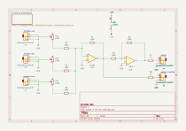
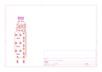

# suma

## Revisiones

- `v-0-rev-a`: única revisión presente en el repositorio.

## Esquemático y placa (v-0-rev-a)

Generados automáticamente por GitHub Actions a partir de `suma/suma-v-0-rev-a/suma-v-0-rev-a.kicad_sch` y `.kicad_pcb` en cada push que los modifica.

## Bill of materials (v-0-rev-a)

Generado a partir de `suma/suma-v-0-rev-a/suma-v-0-rev-a.kicad_sch`.

<!-- BOM_TABLE_START -->
| Referencias | Cantidad | Valor | Huella | Descripción |
| --- | --- | --- | --- | --- |
| D1, D2 | 2 | D_Schottky | easyeda2kicad:SOD-123FL_L2.8-W1.8-LS3.7-R-RD | Diodo Schottky |
| J1, J2, J3, J4, J5 | 5 | AudioJack2_SwitchT | suma-v-0-rev-a:Jack_3.5mm_QingPu_WQP-PJ398SM_Vertical | Jack de audio 3.5mm |
| J7 | 1 | Conn_02x05_Odd_Even | BYOM_General:IDC-Header_2x05_P2.54mm_Vertical | Header de alimentación Eurorack (10 pines) |
| R1, R2, R3, R4, R5, R6 | 6 | 100k | suma-v-0-rev-a:R0805 | Resistencia |
| R7, R8 | 2 | 1k | suma-v-0-rev-a:R0805 | Resistencia |
| RV1, RV2, RV3 | 3 | 100k | suma-v-0-rev-a:POT_TH_Alps_RK09K_Single_Vertical | Potenciómetro |
| U1 | 1 | TL072 | suma-v-0-rev-a:SOIC-8_L4.9-W3.9-P1.27-LS6.0-BL | Amplificador operacional dual |

20 componentes en total.
<!-- BOM_TABLE_END -->
